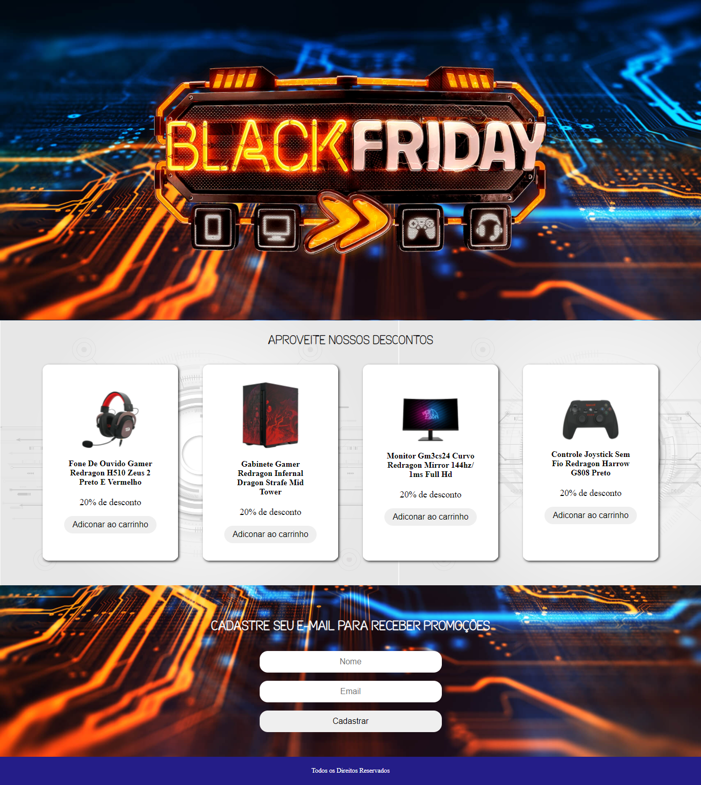

<h1 align="center">
    
Hiring Coders Desafio 1

</h1>

  <a href="#-tecnologias">Tecnologias</a>&nbsp;&nbsp;&nbsp;|&nbsp;&nbsp;&nbsp;
  <a href="#-projeto">Projeto</a>&nbsp;&nbsp;&nbsp;|&nbsp;&nbsp;&nbsp;
  <a href="#-layout">Layout</a>&nbsp;&nbsp;&nbsp;|&nbsp;&nbsp;&nbsp;
  <a href="#-resultado">Resultado</a>&nbsp;&nbsp;&nbsp;|&nbsp;&nbsp;&nbsp;

 

## 🚀 Tecnologias

Esse projeto foi desenvolvido com as seguintes tecnologias:

- HTML
- CSS
- JavaScript

## 💻 Projeto

<h2> Desafio </h2>

- Criar um sistema de e-commerce para cadastro de email na landing page para recebimento de novidades e promoções.

**O que deve ser entregue?**

- Site Oficial / Landing page

**Entregáveis:**

-Template do site oficial;

-Landing page de promoções, estilo black friday;

-Cadastre seu e-mail para receber promoções;

-Dados no localstorage;

- > Não é preciso ter domínio próprio e recomendamos o Netlify para hospedagem.

## 🔖 Layout

    

 
    
 

## Resultado do desafio: 
 

<https://hiring-coders-desafio-01.netlify.app/>

---

